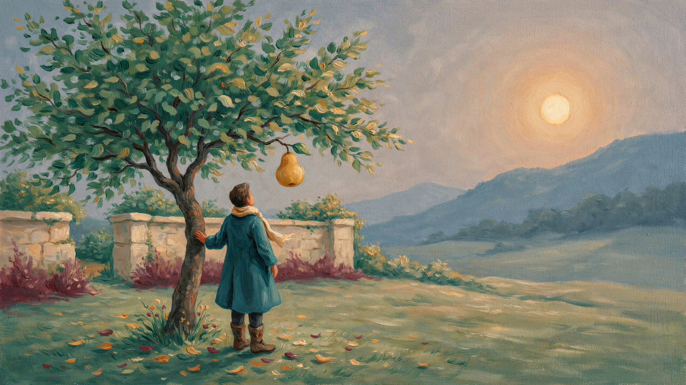
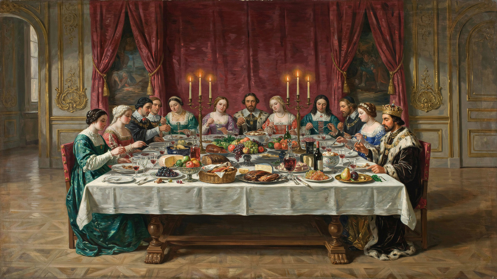
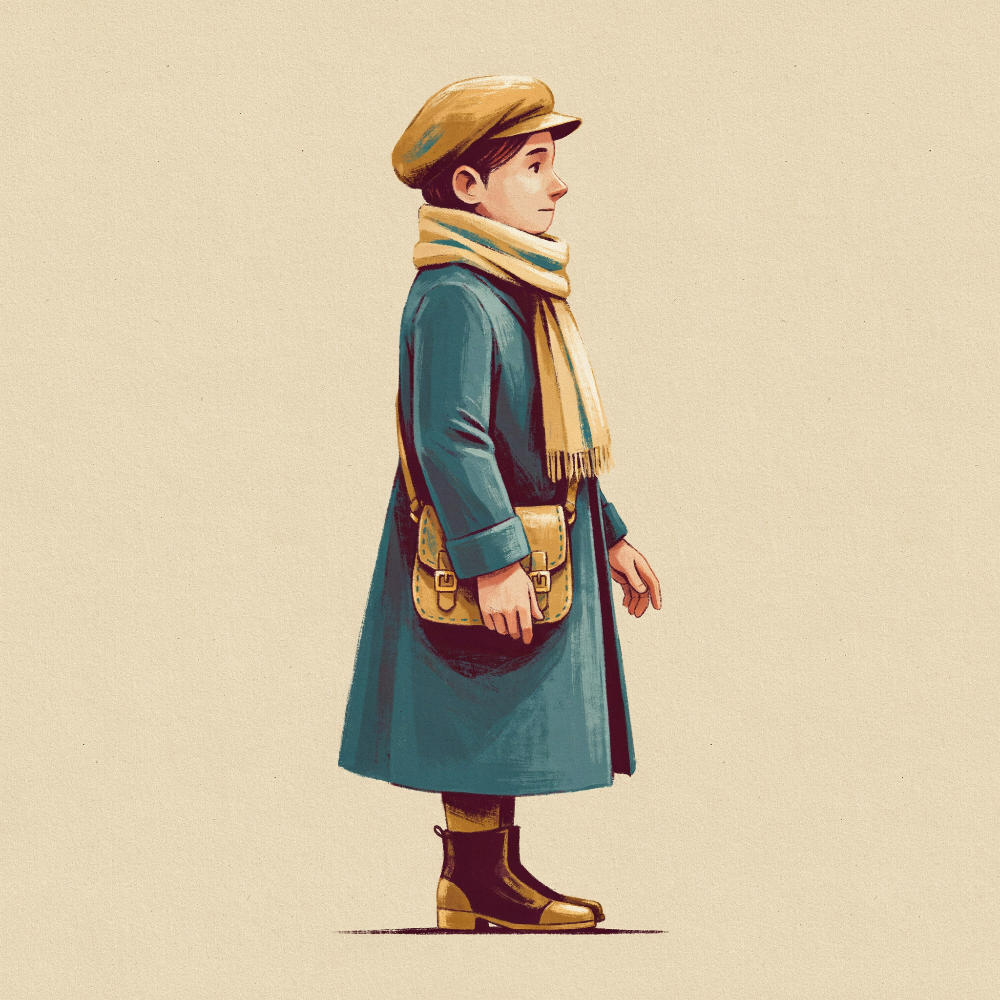

# M3 visual-direction review — 2026-10-05

All three DreamLayer direction references were explicitly approved on 2026-10-05: the user replied “Looks good to me” after the three images were presented. Their source hashes match the manifest. They remain preserved outside the runtime build; production preparation uses their recorded lineage.

**Approved supper direction:** references/banquet-v5.png, revised for the user's fuller whole-table direction. The original banquet and unsuccessful revisions remain preserved with inspection notes in the manifest. Masterpiece and player references were approved unchanged. Do not request this same approval again.

## References to approve

The Garden Before Dawn:

Royal Supper — full-table v5:

Restorer character:

Gameplay layout was approved on 2026-10-05. This review asks only about the illustrated visual direction; the banquet is a reference for style/props, while the approved side-view layout determines actual runtime placement.

| Reference | Source | Delivered size | Execution ID | Observed credits |
| --- | --- | --- | --- | --- |
| The Garden Before Dawn | references/masterpiece.png | 2560 × 1440 | 322dd1c7-2363-4a1b-b69f-d7566cbe0f3e | 1 |
| Royal Supper | references/banquet.png | 2560 × 1440 | 8d317350-cbc8-466f-a2fd-2a79eb6d0ae0 | 1 |
| Restorer | references/player.png | 2048 × 2048 | 61d8b386-263a-427b-979b-16a59109e0ef | 1 |

The detailed provenance manifest includes preserved prompts, stable idempotency keys, public asset/conversation/execution IDs, hashes and before/after API balances. Available balance changed sequentially 100 → 99 → 98 → 97. These are observed balance deltas, not a per-job billing ledger; no other local generation job was running.

## Inspected direction and preparation limits

- Masterpiece: visible oil texture, teal traveller, green tree, large golden pear and warm sun. Pear/sun positions are approximate; production must locally register the targets and restoration masks against the actual image. The displayed reference is the fully coloured composition, not a damaged/restored asset pair.
- Banquet: candlelit red curtains, soft oversized diners, crowned king and gold pear. The small teal traveller is readable. The flattened table is a mood reference, not collision geometry or a playable map. Production background edits must remove foreground route props/player and preserve open space behind authored landing surfaces.
- Player: one right-facing standing pose with scarf, coat, satchel and boots. Feet and silhouette are complete. It delivered a square image despite the requested 3:4 aspect. This is an opaque background and has a baseline shadow; cutout and edge inspection are still needed. It is not an aligned animation sheet. The cap differs from the banquet traveller's hood; the approved standalone player should govern runtime identity.
- Readability against the actual gameplay background, cutout transparency, sprite registration and runtime loading remain unverified until production preparation/integration. No production-quality claim follows from reference generation.

## Camera/layout constraints for the approved production pass

At 1280 × 720 the 13-unit orthographic camera height yields about 55 pixels per unit. The 0.65 × 1.25-unit player occupies about 36 × 69 pixels. At 960 × 540 it occupies about 27 × 52 pixels. Maintain legible cream scarf/face and a separated silhouette at both sizes.

Keep the approved route ending near x435, typed level data, 16-unit fork span, standing goblet clearance, canopy, hazard geometry and checkpoint positions. Bread/dish tops, butter/crumbs, grape approach, cover safety strips and both jelly pads must match authored collision. Three candle tops at x296 / 302 / 308 are 3 units wide, with 3-unit gaps, a 4-unit exit gap and a common decorative trident holder below the route. The canopy underside at y7 permits jumps; heat fills its clearance. Use planes/cutouts or geometry textures; decorative pixels never become colliders. Fork art rotates around its existing pivot and enables its bridge only when settled. Fan/flames follow the actual cyclic extinguishing and relighting state; no permanent snuffer action remains.

Begin with a small player/background/platform slice and inspect it in the approved camera before expanding production. Produce only required background layers, bread/basket, reusable dishes/goblet/cover, butter/crumbs, grapes, fork, fan/trident candles, jelly, matching pear and player frames. Simple flame/feedback may remain authored code. Export prepared runtime images separately under public/assets with logical typed references. The masterpiece needs locally aligned faded/coloured regions and the same pear shape for inspection/inventory. Do not create mountain assets or finish the museum.

The user's revised direction adds fuller scenery groups of wine bottles/decanters, wine glasses, goblets, cutlery, fruit/serving platters and three-candle candelabra. Produce/reuse these only where the actual camera needs them, with a clear playable foreground. The full-table candidate has oblique table depth; do not turn that illustration into collision or directly stretch it across the level. Derive side-view layers/props against the existing camera and place the separate approved player art in runtime.

Current ordinary operation cost: one API credit each for generate, reference edit, cutout or upscale. Sprite access is available; transparent 7-frame output quotes 5.8 credits and 12 frames quote 9.9, with max_credits required if used. The pinned stable CLI supports ordinary images only; sprite work would need a documented beta CLI upgrade. Keep a 20-credit reserve and verify balance before each production batch. No sprite requests have been made.

Original locally synthesized audio is integrated through pinned Howler with explicit activation, saved volume, pause/resume and disposal. Provenance is in audio-manifest.json. Existing DreamLayer art remains integrated. After persistent 503 failures, the user explicitly authorized generating/using the remaining required props here on 2026-10-06; three ImageGen atlases supply 14 prepared props. Providers/billing remain distinct in manifest.json. Validate final actual-camera rendering and the complete loop before committing/pushing completed M3 as authorized. References remain approved; no repeat approval or deployment/submission/email is needed/authorized respectively.

## Local tooling

`dreamlayer@0.3.0` is an exact development dependency. `node scripts/dreamlayer.mjs capabilities --json --quiet` and `node scripts/dreamlayer.mjs balance-current` read the local ignored .env. The bridge privately accepts DREAM_LAYER_API_KEY as an alias for DREAMLAYER_API_KEY; no credential values are stored in source or passed as command arguments. Current-price balance uses the installed CLI's managed client for a read-only query because the stable CLI's default balance returns the legacy $0.17 value. The explicit current-pricing endpoint reports $0.25 per newly purchased credit; image operation pricing is unchanged at one API credit.

`node scripts/reference-set.mjs` skips generated entries and refuses an interrupted planned entry. Recover an uncertain job using the saved identity instead of automatically generating a replacement. Do not change a prompt for an existing idempotency key.
